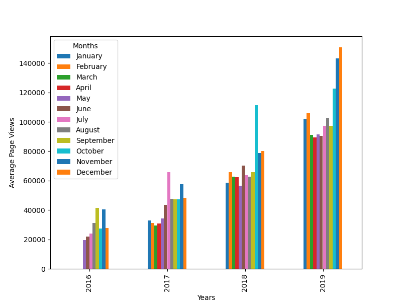

# Time Series Data Visualization

This project is part of the Data Analysis with Python certification by freeCodeCamp. It involves visualizing time series data from the freeCodeCamp.org forum using Pandas, Matplotlib, and Seaborn. The dataset contains daily page views from 2016-05-09 to 2019-12-03.

## Project Overview

The goal of this project is to create visualizations that help understand patterns in page views and identify yearly and monthly trends.

## Visualizations

1. **Line Chart**: Displays daily page views over the specified period.
2. **Bar Chart**: Shows average daily page views for each month grouped by year.
3. **Box Plots**: 
    - Year-wise Box Plot (Trend): Shows the distribution of page views each year.
    - Month-wise Box Plot (Seasonality): Shows the distribution of page views each month.

## Files

- `time_series_visualizer.py`: Contains the functions to create the visualizations.
- `main.py`: Used for development and testing.
- `test_module.py`: Contains unit tests for the project.
- `fcc-forum-pageviews.csv`: Dataset with daily page views.
- `examples/`: Contains example images for reference.

## Instructions

1. **Import the Data**:
    - Load the data from `fcc-forum-pageviews.csv` with the date column set as the index.
2. **Data Cleaning**:
    - Filter out days where page views are in the top or bottom 2.5% of the dataset.
3. **Create Visualizations**:
    - Implement the following functions in `time_series_visualizer.py`:
        - `draw_line_plot()`: Generates a line chart.
        - `draw_bar_plot()`: Generates a bar chart.
        - `draw_box_plot()`: Generates box plots.

## How to Run

1. Clone the repository:
    ```bash
    git clone https://github.com/your-username/your-repo-name.git
    cd your-repo-name
    ```
2. Ensure you have the necessary libraries installed:
    ```bash
    pip install pandas matplotlib seaborn
    ```
3. Run the main file to generate the plots:
    ```bash
    python main.py
    ```

## Examples

Below are examples of the generated visualizations:

### Line Chart


### Bar Chart


### Box Plots

